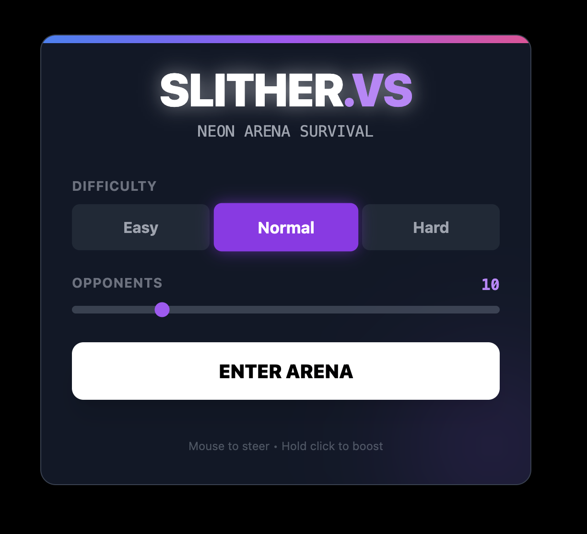
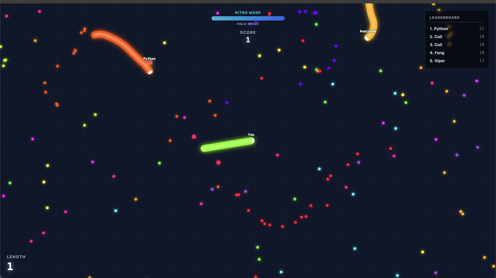

<div align="center">

# 🐍 SLITHER.VS

### ⚡ **NEON ARENA SURVIVAL** ⚡

**A high-performance arcade snake game where you compete against AI bots in a massive neon arena**

### 🎮 [Play Online Now](https://adylevy.github.io/slither-vs-bots/)

[](https://opensource.org/licenses/MIT)
[](https://www.typescriptlang.org/)
[](https://reactjs.org/)
[](https://vitejs.dev/)

[🌐 Live Demo](https://adylevy.github.io/slither-vs-bots/) • [🎮 Play Now](#-quick-start) • [📖 Features](#-features) • [🚀 Tech Stack](#-tech-stack) • [🤝 Contributing](#-contributing)

---

</div>

## ✨ Screenshots

<div align="center">

### 🎯 Main Menu


_Customize difficulty and opponent count before entering the arena_

### 🎮 Gameplay


_Compete against AI bots, grow your snake, and climb the leaderboard_

</div>

---

## 🎯 Features

- 🎨 **Stunning Neon Visuals** - Beautiful gradient UI with glowing effects
- 🤖 **AI Opponents** - Battle against intelligent bots with customizable difficulty
- 📊 **Real-time Leaderboard** - Compete and track your rank
- ⚡ **Nitro Boost System** - Hold space to boost and outmaneuver opponents
- 🎚️ **Customizable Difficulty** - Easy, Normal, and Hard modes
- 👥 **Adjustable Bot Count** - Control the number of opponents (1-20+)
- 🏆 **Score Tracking** - Track your length and score in real-time
- 🎮 **Smooth Controls** - Mouse steering with intuitive click-to-boost

---

## 🚀 Tech Stack

- **Frontend**: React 19 + TypeScript
- **Build Tool**: Vite 6
- **Rendering**: Canvas API with custom renderer
- **Game Engine**: Custom spatial hash system for collision detection
- **Styling**: Tailwind CSS (via inline styles)

---

## 🎮 Quick Start

### Prerequisites

- **Node.js** 18+ and npm

### Installation

```bash
# Clone the repository
git clone https://github.com/yourusername/slither-vs-bots.git
cd slither-vs-bots

# Install dependencies
npm install

# Start the development server
npm run dev
```

Open [http://localhost:5173](http://localhost:5173) in your browser and start playing!

### Build for Production

```bash
npm run build
npm run preview
```

---

## 🎯 How to Play

1. **Start**: Click "ENTER ARENA" from the main menu
2. **Steer**: Move your mouse to control your snake's direction
3. **Boost**: Hold left-click (or spacebar) to activate nitro boost
4. **Grow**: Collect colorful dots to increase your length and score
5. **Survive**: Avoid colliding with other snakes or yourself
6. **Dominate**: Climb the leaderboard and become the top snake!

### Controls

- 🖱️ **Mouse Movement** - Steer your snake
- 🖱️ **Left Click** - Hold to boost (uses nitro energy)
- ⌨️ **Spacebar** - Alternative boost control

---

## 🏗️ Project Structure

```
slither-vs-bots/
├── components/          # React components
│   ├── GameCanvas.tsx   # Main game canvas
│   ├── HUD.tsx          # Heads-up display
│   └── Menu.tsx         # Main menu
├── services/            # Game logic services
│   ├── GameEngine.ts    # Core game engine
│   ├── Renderer.ts      # Canvas rendering
│   └── SpatialHash.ts   # Collision detection
├── types.ts             # TypeScript definitions
├── constants.ts         # Game constants
└── App.tsx              # Main app component
```

---

## 🤝 Contributing

Contributions are welcome! Feel free to:

1. 🍴 Fork the repository
2. 🌿 Create a feature branch (`git checkout -b feature/amazing-feature`)
3. 💾 Commit your changes (`git commit -m 'Add amazing feature'`)
4. 📤 Push to the branch (`git push origin feature/amazing-feature`)
5. 🔀 Open a Pull Request

### Ideas for Contributions

- 🎨 New visual effects and themes
- 🤖 Improved AI bot behaviors
- 🎵 Sound effects and music
- 📱 Mobile touch controls
- 🌐 Multiplayer support
- 🏆 Achievement system

---

## 📄 License

This project is licensed under the MIT License - see the [LICENSE](LICENSE) file for details.

---

<div align="center">

### ⭐ Star this repo if you enjoyed it! ⭐

**Made with ❤️ and ⚡ by the community**

[⬆ Back to Top](#-slithervs)

</div>
